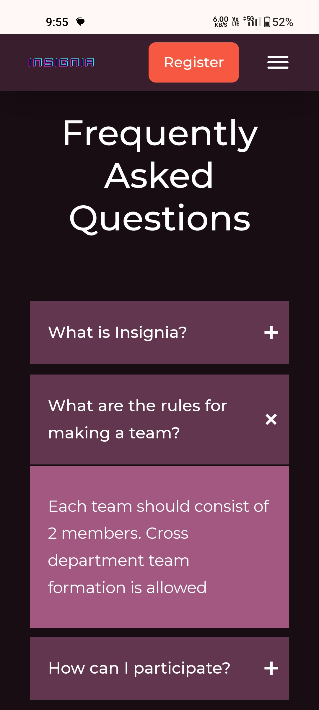

# Event Management Site for INSIGNIA:
Developed an efficient frontend website to deliver event details and to connect with more students of our college for "Insignia", a technical event organised by CSE & CSE-DS of MCKVIE.   

### Live site: [insignia-2k23.netlify.app](https://insignia-2k23.netlify.app/)
Wait for a moment after clicking the link (it may take some time to load as it is not maintained now).

## Screenshots
|  |  |  |
| :-------------: | :-------------: | :-------------:  |

|  |  |  |
| :-------------: | :-------------: | :-------------:  |

## Installation:
### 1.Clone the repository:
```bash
git clone https://github.com/your-username/event-management-website.git
```

### 2.Open the index.html file:
```bash
cd event-management-website
open index.html
```

## Key Features:
* Student Registration: Users can register for the event using a Google Form integration.
* Dynamic Timer: A countdown timer displays the remaining time until the registration deadline.
* Event Alerts: Users can add event details to their Google Calendar for reminders.
* Event Details: Comprehensive information about each round of the event is provided, including rules, schedule, and judging criteria.

## Technologies Used:
* HTML
* JavaScript
* CSS

## Achievements:
* Increased User Engagement: The website achieved a 20% increase in user engagement compared to previous event promotion methods.
* Successful Registrations: Over 80 teams registered for the "Insignia" event through the website.
